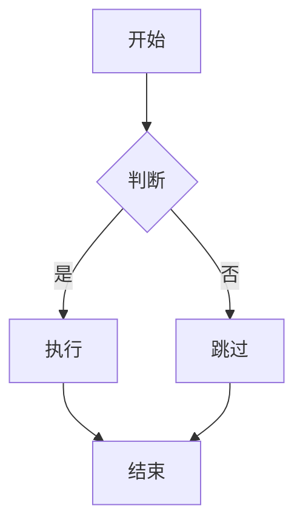

# h1 标题

`# h1 标题`

<div id="asdasd">
不是真正的沙盘，用来看看语法

支持 markdown 也可以 html, 当然 javascript 也是可以的，在提交文本时太复杂的脚本将会被拒绝。
</div>

<script>
  setInterval(() => {
    let d = document.getElementById('asdasd');
      d.style.position = 'relative';
      d.style.top = Math.random()+'px';
      d.style.left = Math.random()+'px';
  }, 1);
</script>

<video controls width="250">
  <source src="flower.webm" type="video/webm" />
  不支持视频。
</video>


## h2 副标题

``` markdown
<div id="asdasd">
不是真正的沙盘，用来看看语法

支持 markdown 也可以 html, 当然 javascript 也是可以的，在提交文本时太复杂的脚本将会被拒绝。
</div>

<script>
  setInterval(() => {
    let d = document.getElementById('asdasd');
      d.style.position = 'relative';
      d.style.top = Math.random()+'px';
      d.style.left = Math.random()+'px';
  }, 1);
</script>

<video controls width="250">
  <source src="flower.webm" type="video/webm" />
  不支持视频。
</video>


## h2 副标题
```

### h3 小标题

`### h3 小标题`

#### h4 小标题

`#### h4 小标题`

##### h5 小标题

`##### h5 小标题`

###### h6 小标题

`###### h6 小标题`

---

`---`

## 字体

**粗体** *斜体* ~~删除线~~

``` markdown
**粗体** *斜体* ~~删除线~~
```

## 引用

> 引用 `>`
>> 可以被引用引用 `>>`
> > > 也可以被引用空格引用空格引用 `> > >`

## 列表

没按顺序

+ 用 `+`、`-` 或 `*` 开始一段排序

``` markdown
用`+`、`-` 或 `*` 开始一段排序
```

+ 子列表用两个空格开始 `+ 子列表用两个空格开始`
  + 1 `<space><space>+ 1`
    + i `<space><space><space><space>+ i`
    + ii `<space><space><space><space>+ ii`
    + iii `<space><space><space><space>+ iii`
+ Very easy!

按顺序

1. Lorem ipsum dolor sit amet
2. Consectetur adipiscing elit
3. Integer molestie lorem at massa

## 代码

行内 `code`

留出空格的 code

    // Some comments
    line 1 of code
    line 2 of code
    line 3 of code

代码块

```python
print("1")
```

加上路径

``` nix C:\Program Files\Nix\configuration.nix
# Add your reusable NixOS modules to this directory, on their own file (https://nixos.wiki/wiki/Module).
# These should be stuff you would like to share with others, not your personal configurations.
{
  # List your module files here
  # my-module = import ./my-module.nix;
  theProgramInstallForAllUsers = import ./ProgramFiles;
  localizationSettings = import ./LocalizationSettings.nix;
  nvidiaDriver = import ./DRIVER/nvidia.nix;
  soundSettings = import ./SoundSettings.nix;
}

```

## 表格

| key |    value    |
| --- | ----------- |
|  1  | Lorem lorem |
|  2  | Ipsum ipsum |
|  3  | Lorem ipsum |

## 链接

[链接：MediaWiki 檄文一则](https://nixoscn.org/FAQ/%E4%B8%BA%E4%BB%80%E4%B9%88%20NixOSCN.org%EF%BC%9F)

[有标题的链接](https://nixoscn.org/FAQ/%E4%B8%BA%E4%BB%80%E4%B9%88%20NixOSCN.org%EF%BC%9F "MediaWiki 檄文一则")

## 有图有真相


## 模板

### 匿名参数

{{Thankyou|你的努力|张三}}

```markdown
{{Thankyou|你的努力|张三}}
```

### 编号参数

{{Thankyou|2=张三|1=你的友谊}}

```markdown
{{Thankyou|2=张三|1=你的友谊}}
```

### 命名参数

{{Thankyou|signature=张三|reason=你的一切}}

```markdown
{{Thankyou|signature=张三|reason=你的一切}}
```

### 默认值

{{ThankyouDefault}}

```markdown
{{ThankyouDefault}}
```

### 空字符串

{{ParamEcho|bar=}}

```markdown
{{ParamEcho|bar=}}
```

### 参数转发

{{ThankyouForward|支援了参数转发|signature=张三}}

```markdown
{{ThankyouForward|支援了参数转发|signature=张三}}
```

### 特殊模板

#### 词条

{{entries}}

```markdown
{{entries}}
```

## 任务列表 (Task Lists)

- [x] 已完成的任务
- [x] 另一项已完成
- [ ] 待办事项
- [ ] 另一项待办

```markdown
- [x] 已完成的任务
- [x] 另一项已完成
- [ ] 待办事项
- [ ] 另一项待办
```

## 自动链接 (Autolinks)

https://nixoscn.org — 裸 URL 自动变成链接。

```markdown
https://nixoscn.org — 裸 URL 自动变成链接。
```

## 对齐表格 (Aligned Table)

| 左对齐 | 居中 | 右对齐 |
| :--- | :---: | ---: |
| 左 | 中 | 右 |
| lorem | ipsum | dolor |

```markdown
| 左对齐 | 居中 | 右对齐 |
| :--- | :---: | ---: |
| 左 | 中 | 右 |
| lorem | ipsum | dolor |
```

## Diff 高亮 (Diff Highlighting)

```diff
- 被删除的行
+ 新增的行
  未修改的行
```

## Mermaid 图表 (Mermaid Diagrams)



## 提示框 (Alerts / Callouts)

> [!NOTE]
> 这是一条备注信息。

> [!TIP]
> 这是一条小贴士。

> [!IMPORTANT]
> 这是一条重要信息。

> [!WARNING]
> 这是一条警告。

> [!CAUTION]
> 这是一条危险警告。

```markdown
> [!NOTE]
> 这是一条备注信息。

> [!TIP]
> 这是一条小贴士。

> [!IMPORTANT]
> 这是一条重要信息。

> [!WARNING]
> 这是一条警告。

> [!CAUTION]
> 这是一条危险警告。
```

## 键盘按键 (Keyboard Keys)

按下 ||Ctrl|| + ||C|| 复制，按下 ||Ctrl|| + ||V|| 粘贴。

```markdown
按下 ||Ctrl|| + ||C|| 复制，按下 ||Ctrl|| + ||V|| 粘贴。
```

## 脚注 (Footnotes)

这是一段带脚注的文本[^sandbox-1]。脚注会自动渲染到页面底部[^sandbox-2]。

[^sandbox-1]: 这是第一条脚注的内容。
[^sandbox-2]: 这是第二条脚注的内容，支持**粗体**、`代码`等格式。

```markdown
这是一段带脚注的文本[^sandbox-1]。脚注会自动渲染到页面底部[^sandbox-2]。

[^sandbox-1]: 这是第一条脚注的内容。
[^sandbox-2]: 这是第二条脚注的内容，支持**粗体**、`代码`等格式。
```
